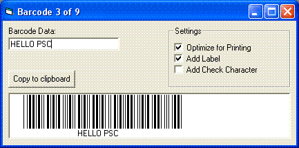



## Barcode 39 maker

### Description

Generate 3 of 9 barcode (in just 1 sub). No special fonts used, just code. This is an update to one of my old submissions.
 
### More Info
 

             |
---                |---
**Submitted On**   |2004-10-31 19:00:20
**By**             |[Paul Bahlawan](https://github.com/Planet-Source-Code/PSCIndex/blob/master/ByAuthor/paul-bahlawan.md)
**Level**          |Beginner
**User Rating**    |5.0 (30 globes from 6 users)
**Compatibility**  |VB 5\.0, VB 6\.0
**Category**       |[Miscellaneous](https://github.com/Planet-Source-Code/PSCIndex/blob/master/ByCategory/miscellaneous__1-1.md)
**World**          |[Visual Basic](https://github.com/Planet-Source-Code/PSCIndex/blob/master/ByWorld/visual-basic.md)
**Archive File**   |[Barcode\_391812951112004\.zip](https://github.com/Planet-Source-Code/paul-bahlawan-barcode-39-maker__1-57042/archive/master.zip)

